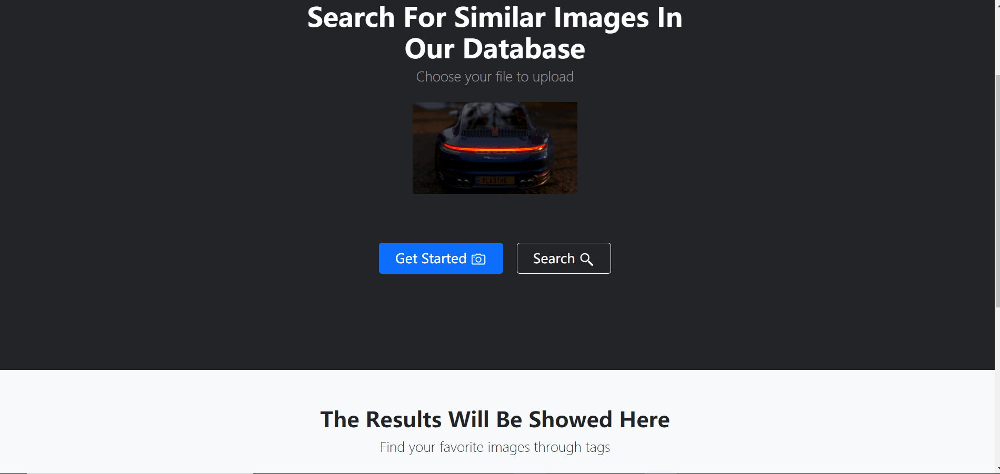

[TOC]

# Assignment 2: Information Retrieval

## Interface Preview

### Home Page

### Tag

### Preview & Searching

### Results

### Favorites

## Manual

1. Click "Home" to refresh the page and return to the home page.

   

2. Click "Tag" to turn to the Tag Section.

   

3. Click "Favorites" to turn to the Favorites Section.

   

4. Choose zero or more tags to filter the images before searching.

   

5. Click the "Get Started" button to upload your file.

   

6. Click the "Search" button to start searching.
   

7. Choose zero or more tags to filter the result images.

   

8. Click the "Clear" button to clear the results.

   

9. Click the star icon to add images into or remove images from your favorites.

   

## Requirements of an Image Search Task

**Basic**

1. A clear and concise interface with some pre-suggestions.
2. An input box for inputing key words or uploading images with preview.
3. A search button to execute searching.
4. Provide an overview (total number).
5. Be able to display the searching results with a brief description.
6. Be able to search by additional conditions (color,type...).
7. Be able to zoom in to see the images and save.

**More**

1. Varieties of search method (phonetic search).
2. Input with help of auto-completion.
3. Categorize results using metadata.
4. Allow adjustment of the size of the result set.
5. Allow change of sequencing (alphabetical, chronological, relevance ranked, etc).
6. Provide related searches of the result set.
7. Explore collecting explicit feedback (ratings, reviews, like, etc).

## Designs for Five Stages

### Formulation

1. Provide an input box for uploading images.
2. After an image was uploaded, a preview will be shown.

### Initiation

1. When the search button is clicked, the searching process starts.

### Review

1. Keep search terms and constrains visible.
2. Provide an overview of results (total number).
3. Provide descriptive previews of each result item.

### Refinement

1. Allow changing search parameters (select certain tag) when reviewing results.

### Use

1. Allow adding/removing selected images to/from a favorite list.

## How to run

Environment: python 3.8.8

1. Decompress the file.
2. Install the concerned packages if needed.
3. Change the directory to "lab2-image-retrieval" and move the local folder "database" into "lab2-image-retrieval/server".
4. Terminal run: python rest-server.py.