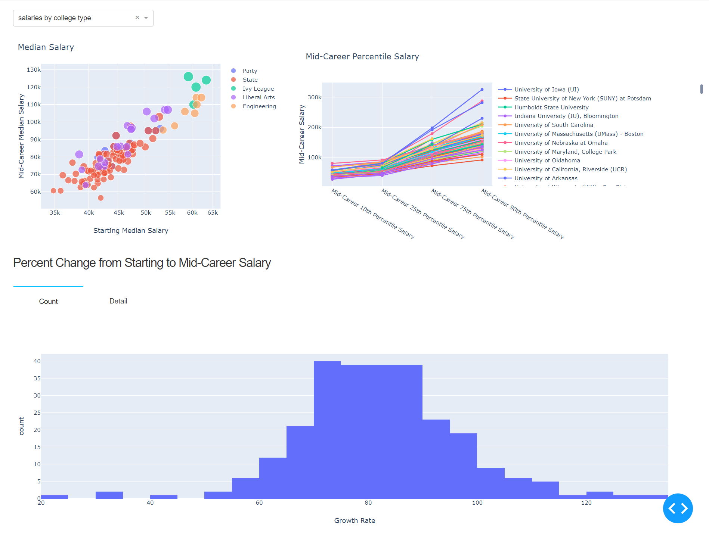
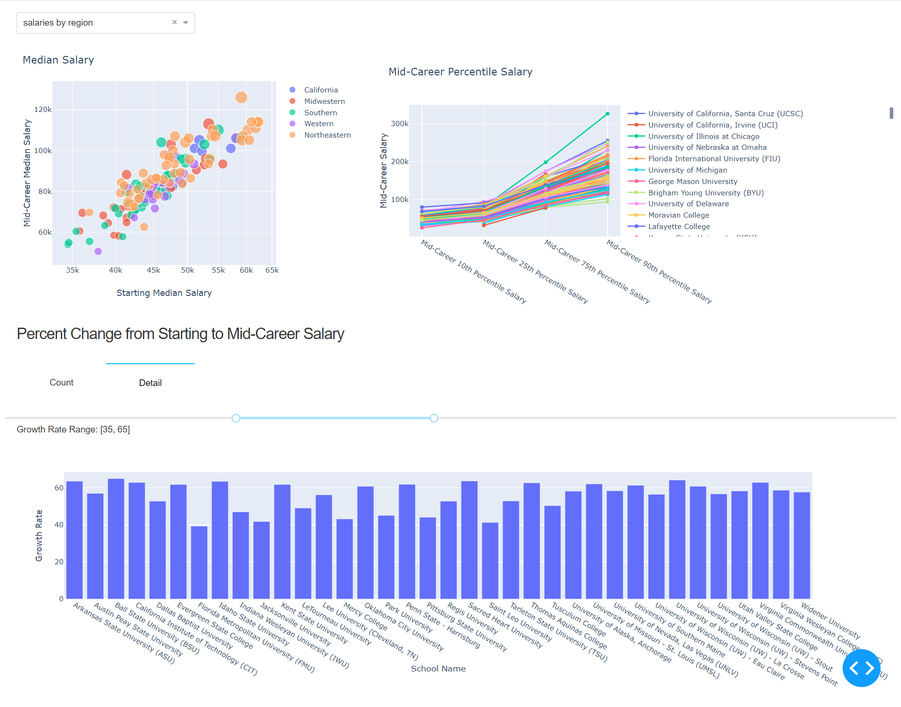
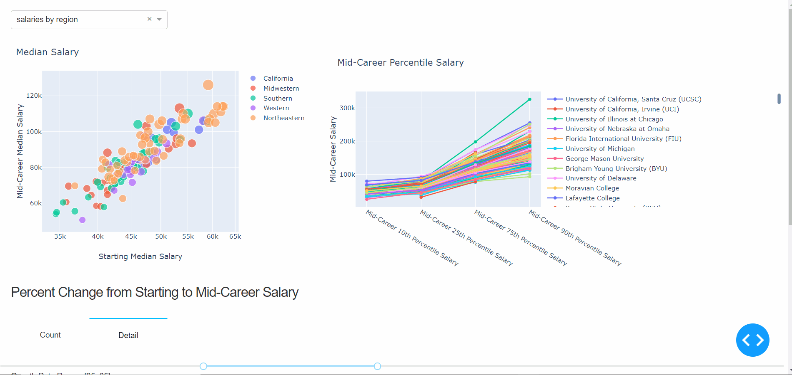
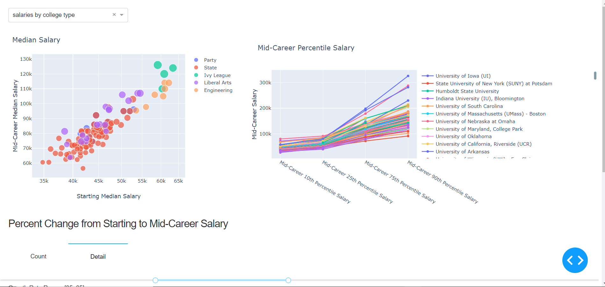
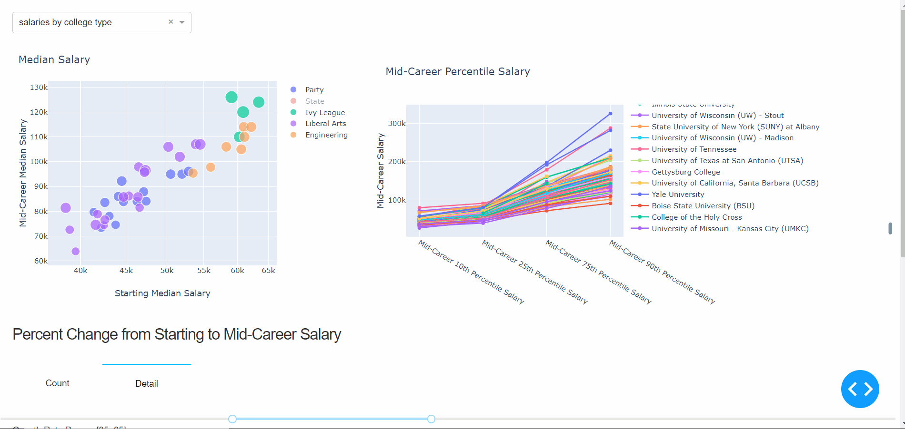
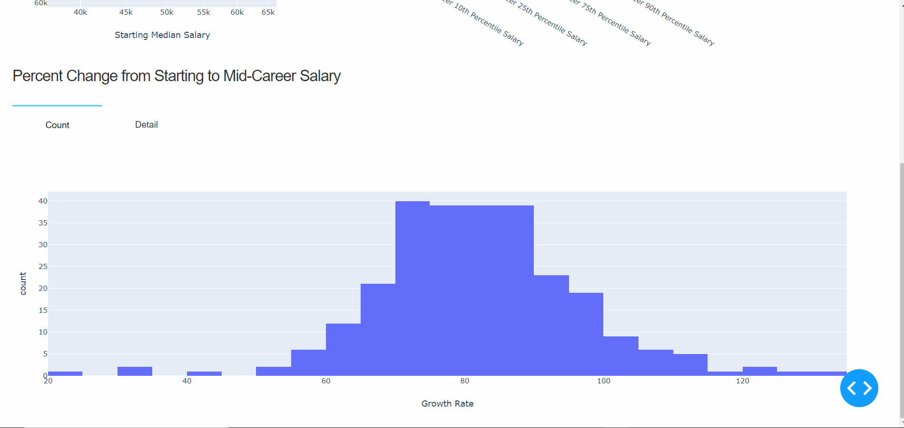
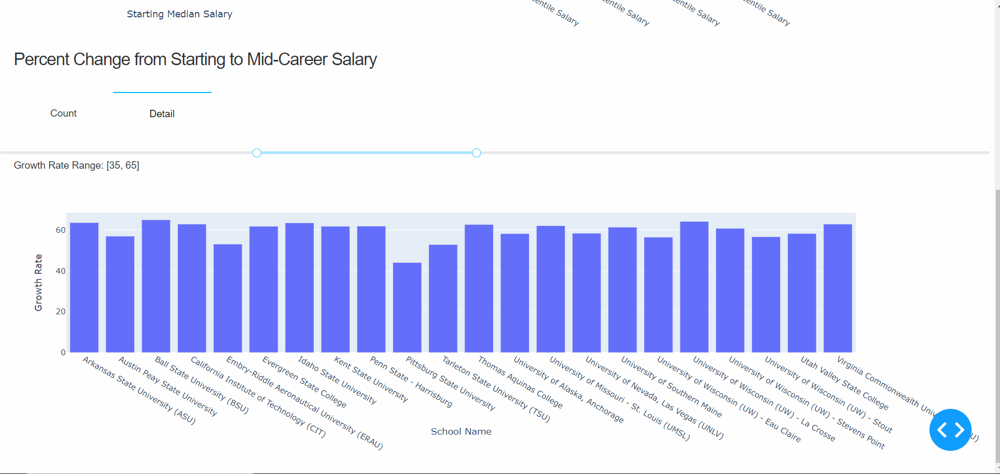

[TOC]

# Assignment 3: Data Visualization

## Interface Preview

## Data Analysis

### Data Sets——college-salaries

1. degrees-that-pay-back

   | Undergraduate Major   | Starting Median Salary | Mid-Career Median Salary | Percent change from Starting to Mid-Career  Salary | Mid-Career 10th Percentile Salary | Mid-Career 25th Percentile Salary | Mid-Career 75th Percentile Salary | Mid-Career 90th Percentile Salary |
   | --------------------- | ---------------------- | ------------------------ | -------------------------------------------------- | --------------------------------- | --------------------------------- | --------------------------------- | --------------------------------- |
   | Accounting            | 46000                  | 77100                    | 67.6                                               | 42200                             | 56100                             | 108000                            | 152000                            |
   | Aerospace Engineering | 57700                  | 101000                   | 75                                                 | 64300                             | 82100                             | 127000                            | 161000                            |
   | Agriculture           | 42600                  | 71900                    | 68.8                                               | 36300                             | 52100                             | 96300                             | 150000                            |
   | Anthropology          | 36800                  | 61500                    | 67.1                                               | 33800                             | 45500                             | 89300                             | 138000                            |
   | Architecture          | 41600                  | 76800                    | 84.6                                               | 50600                             | 62200                             | 97000                             | 136000                            |
   | ...                   | ...                    | ...                      | ...                                                | ...                               | ...                               | ...                               | ...                               |

2. salaries-by-college-type

   | School Name                                   | School Type | Starting Median Salary | Mid-Career Median Salary | Mid-Career 10th Percentile Salary | Mid-Career 25th Percentile Salary | Mid-Career 75th Percentile Salary | Mid-Career 90th Percentile Salary |
   | --------------------------------------------- | ----------- | ---------------------- | ------------------------ | --------------------------------- | --------------------------------- | --------------------------------- | --------------------------------- |
   | Massachusetts Institute of Technology  (MIT)  | Engineering | 72200                  | 126000                   | 76800                             | 99200                             | 168000                            | 220000                            |
   | California Institute of Technology (CIT)      | Engineering | 75500                  | 123000                   | N/A                               | 104000                            | 161000                            | N/A                               |
   | Harvey Mudd College                           | Engineering | 71800                  | 122000                   | N/A                               | 96000                             | 180000                            | N/A                               |
   | Polytechnic University of New York,  Brooklyn | Engineering | 62400                  | 114000                   | 66800                             | 94300                             | 143000                            | 190000                            |
   | Cooper Union                                  | Engineering | 62200                  | 114000                   | N/A                               | 80200                             | 142000                            | N/A                               |
   | ...                                           | ...         | ...                    | ...                      | ...                               | ...                               | ...                               | ...                               |

3. salaries-by-region

   | School Name                              | Region     | Starting Median Salary | Mid-Career Median Salary | Mid-Career 10th Percentile Salary | Mid-Career 25th Percentile Salary | Mid-Career 75th Percentile Salary | Mid-Career 90th Percentile Salary |
   | ---------------------------------------- | ---------- | ---------------------- | ------------------------ | --------------------------------- | --------------------------------- | --------------------------------- | --------------------------------- |
   | Stanford University                      | California | 70400                  | 129000                   | 68400                             | 93100                             | 184000                            | 257000                            |
   | California Institute of Technology (CIT) | California | 75500                  | 123000                   | N/A                               | 104000                            | 161000                            | N/A                               |
   | Harvey Mudd College                      | California | 71800                  | 122000                   | N/A                               | 96000                             | 180000                            | N/A                               |
   | University of California, Berkeley       | California | 59900                  | 112000                   | 59500                             | 81000                             | 149000                            | 201000                            |
   | Occidental College                       | California | 51900                  | 105000                   | N/A                               | 54800                             | 157000                            | N/A                               |
   | ...                                      | ...        | ...                    | ...                      | ...                               | ...                               | ...                               | ...                               |

### Characteristics

1. Three sub-datasets in the college-salaries dataset has many of the same columns.
2. Significantly, there are two primary features in these three datasets——"Starting Median Salary" and "Mid-Career Median Salary", which represent the threshold and prospect of a certain career respectively.
3. "Mid-Career XXth Percentile Salary" columns show the development of a career.
4. "Percent change from Starting to Mid-Career  Salary" directly and clearly shows the growth rate of salary.
5. The specific columns like "School Name","Region","School Type" and so on reflect a distinctive features of the distribution of college salaries. 

## Dashboard Design for Data Sets

For the above analysis of data set characteristics：

1.  Switching through drop-down is suitable for displaying the information of three data sets.
2. A bubble plot for displaying the relationship between "Starting Median Salary" and "Mid-Career Median Salary", while showing the "Mid-Career 75th Percentile Salary" through the size of bubbles.
3. A line-scatter chart using the "Mid-Career XXth Percentile Salary" to show the development of a career.
4. A histogram to show the general distribution of salary growth and a bar chart to reveal the growth explicitly.
5. "School Name","Region" and so on as legends to compare the salary.

## Manual

1. Select the data to show through drop-down.

   

2. Hover on the data points or lines to view details.

   

3. Click the legend to filter the data.

   

4. Click "Count/Detail" to view general situation/details of the percent change from starting to mid-career salary.

   

5. Drag the slider to filter the data on the details page.

   

## How to run

Environment: python 3.8.8

Code Structure:

- dashboard.py to run the dashboard app.
- pre.py, pre2.py, pre3.py used to preprocessing the data sets and draw the plots.

Step:

1. Decompress the file and enter the directory.
2. Install the concerned packages if needed.
4. Terminal run: python dashboard.py.